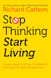

# Introduction

Intro of the Books

## Short Summary

Author explains about How to enjoy life without constant thinking

    - Our thinking keeps the mind busy - Positive and negative thinking
    - For well-being of life - we have to cut down the thinking and live at the present

### Negative Thinking

    - Worst thing to do
    - Thinking all the time and creating the worst-scenario in our mind
    - Negative thinking have worst side effects and not able to live the life to full potential

<aside>
💡 Being upset by your own thoughts is similar to writing yourself a nasty letter – and then being offended by that letter!

</aside>

### What thinks to do stop Over Thinking

Steps to follow to stop over thinking

- Live at the present moment now
- Stop thinking about others ( They don't give damn about you)
- Do not try to analyse every thought and let it pass
- Below is one of the beautiful quote from Author

<aside>
🗒️ 🚀 True happiness occurs when you quiet down your analytical mind, when you give it a rest.

</aside>

### Conclusion

- Do not think too much
- You cannot control the past nor predict the future
- Live at the present moment
- Do not Hurry
- Let go off the negative thoughts - Forgive and move on - Do not hold grudges
- Do not have firm opinion
- Try to find happiness in every situation